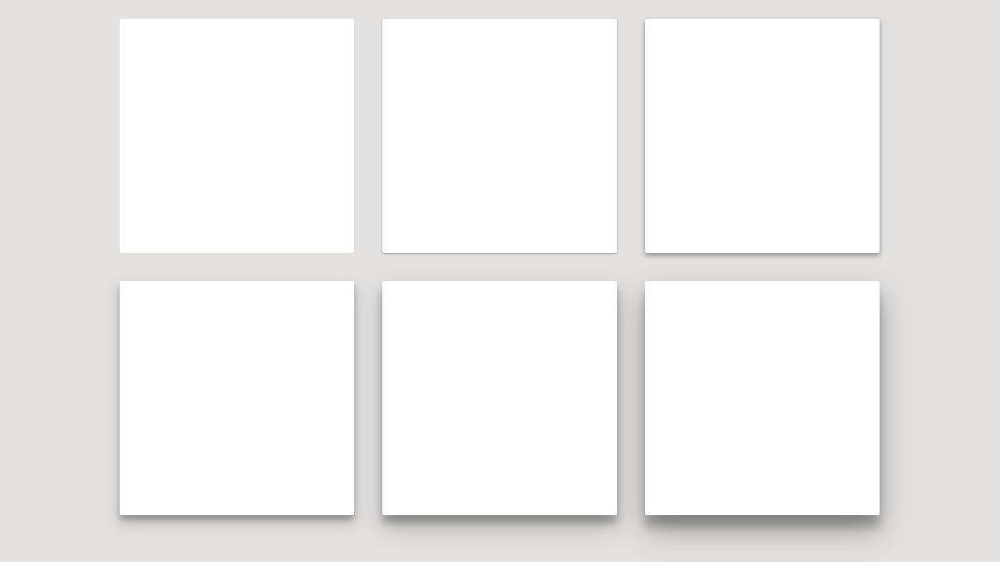

# React interview

1. In `StylingComponent` creati un input de tip text care:
    1. Sa aiba lungimea de 300px
    2. Sa aiba culoarea verde a textului daca lungimea textului introdus este <= 2
    3. Sa aiba culoarea galben a textului daca lungimea textului introdus este > 2 si <= 6
    4. Sa aiba culoarea rosie a textului daca lungimea textului introdus este > 6 si <= 10
    5. Sa nu permita introducerea unui text mai lung de 10 caractere

2. Definiti intr-un fisier nou o componenta cu numele `CardComponent` care:
    1. Sa primeasca prin props o denumire
    2. Sa primeasca prin props o culoare
    3. Sa aiba o umbra de stil card

    

    4. Sa se afiseze in card denumirea din props si background-ul cardului sa aiba culoarea primita in props

3. Creati un higher order component denumit `withClicker` care sa primeasca o alta componenta si sa adauge dedesubtul ei un buton cu textul "Click me".

4. In `StylingComponent` afisati o lista de `CardComponent` combinate cu `withClicker` care sa afiseze metalele din array-ul `metals`

    

5. In `StylingComponent` afisati un unic contor care sa se incrementeze la fiecare apasare de buton "Click me" din cadrul oricarei componente din lista de la punctul 4.

6. In `StylingComponent` creati un buton care:
    1. Sa aiba textul "Inainte"
    2. Sa fie disabled atunci cand valoarea textului introdus in inputul de la punctul 1. este diferita de "next", case insensitive
    3. Sa la apasarea butonului, utilizatorul va fi trimis pe `DataLoadingComponent`
    
7. In `DataLoadingComponent` efectuati un apel GET la adresa `/Api/Tools/Get` cu parametrul key="fg08" si afisati fiecare element din array-ul returnat `tools` in cate un element de tip div.